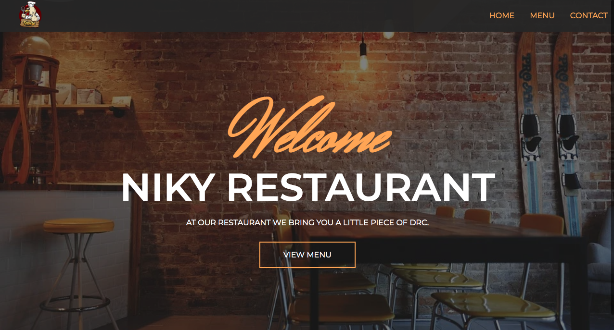

# Niky Restaurant

> This project comes after the introduction of the ES6 class keyword, ES6 modules, and webpack. The main goal of this project is to show the understanding of the benefits of modularized code as well as the ability to set up a javascript application made of different modules using webpack.

This website was designed with the tools below:

## Built With

- Javascript
- CSS

## Getting Started

**To get the local copy of the project up and running you will need to run the following commands on your terminal:**

`git clone https://github.com/barackm/restaurant-page`

To install all the available dependecies run:
`npm install`

To bundle and transpile the javascript code using webpack run:
`npm run build` for production, or:
`npm run dev` for development.

Now you can open up the index.html file (located in the dist directory in chrome) to see the result.

## Author

👤 **Barack Mukelenga**

- GitHub: [@barackm](https://github.com/barackm)
- Twitter: [@BarackMukelenga](https://twitter.com/BarackMukelenga)
- LinkedIn: [Baraka Mukelenga](https://www.linkedin.com/in/baraka-mukelenga/)

## 🤝 Contributing

Contributions, issues, and feature requests are welcome!

Feel free to check the [issues page](https://github.com/barackm/restaurant-page/issues).

## Show your support

Give a ⭐️ if you like this project!❤️❤️❤️

## Acknowledgments

- Microverse)
